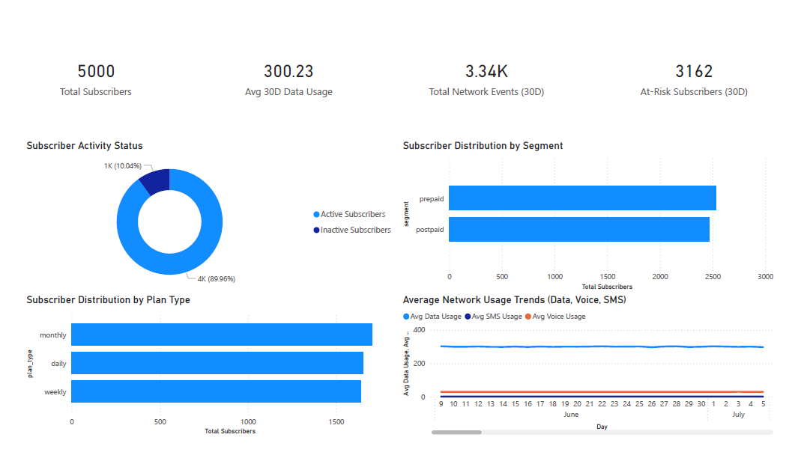
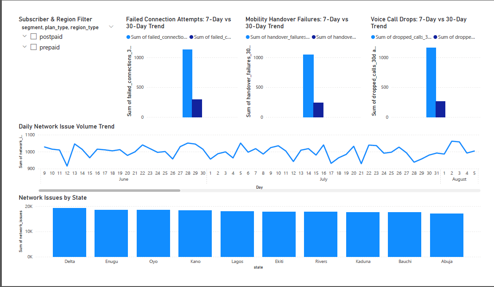
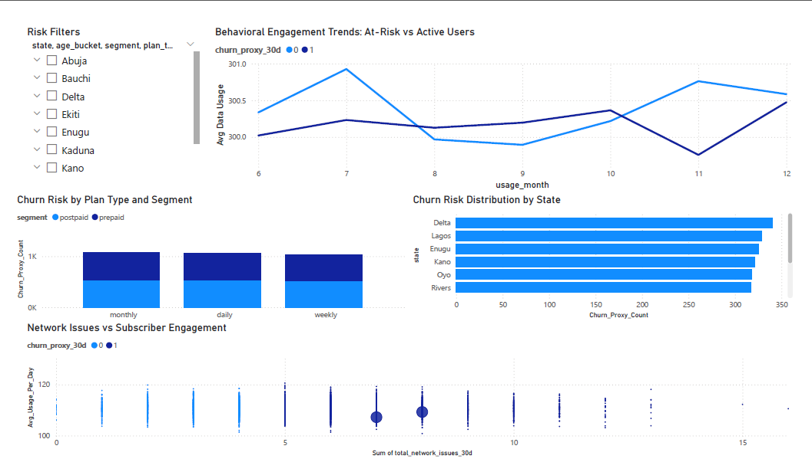

# Telecom_Subscriber_Usage-Engagement_Analytics

## Business Problem

Telecom operators lose revenue through:  
- Network instability  
- Behavioral disengagement  
- Poor churn detection  

This project analyzes how network failures propagate into usage decline and churn probability.

## Tools

Power BI, SQL, DAX

## PowerBI Dashboards

### Executive Summary Dashboard

### Usage & Engagement Analysis Dashboard

### Network Events Dashboard

### Engagement Risk Analysis Dashboard

## Executive Summary Dashboard

This dashboard provides a high-level overview of subscriber scale, engagement health, service utilization, and early-stage churn exposure across the telecom network.

### Key Findings
- The network supports a large and active subscriber base, with over 90% of users currently active, indicating strong system-wide engagement.
- Average 30-day data usage is consistently high, confirming that data services are the primary value driver across the network.
- Total network events over the last 30 days remain elevated, reflecting persistent operational load and infrastructure stress.
- The behavioral churn proxy identifies a small but critical at-risk group, signaling early intervention before churn occurs.

#### 1. Market structure observations:
- Prepaid subscribers dominate the customer base, reinforcing high sensitivity to service quality, pricing, and promotional competition. 
- Monthly plans lead total adoption, followed by daily plans, indicating strong customer preference for predictable billing structures.

#### 2. Usage behavior summary:
- Data usage remains structurally higher than voice and SMS across all time periods.
- Voice continues to play a supporting revenue role.
- SMS volume remains consistently minimal.
- Overall trends are stable, indicating no system-wide behavioral collapse at this stage.

### Strategic Implications
- Network stability directly protects the prepaid customer base, which represents the highest revenue exposure.
- Monthly plan dominance creates favorable cash flow predictability but also raises churn cost if dissatisfaction emerges.
- Behavioral churn detection should focus on the small but identifiable at-risk group for early retention actions.

## Usage & Engagement Analysis Dashboard

This dashboard evaluates how subscribers actively use network services and how consistently they remain engaged across voice, data and SMS usage. It also examines how spending behavior and inactivity patterns interact at the individual subscriber level.

### Key Findings

#### 1. Strong multi-service usage with late period decline:
Voice, data, and SMS all exhibit stable usage patterns for most of the observed period. However, a synchronized drop across data, voice, and SMS at the end of the period suggests a system-wide disruption, likely caused by network instability, outages, or short-term service degradation rather than user churn behavior. The steepest decline occurring in data usage confirms that data access is the most sensitive early indicator of engagement breakdown.

#### 2. Recharge and usage relationship shows behavioral diversity:
The scatter plot reveals a loosely correlated relationship between recharge value and actual service consumption. While higher recharge generally supports higher usage, there is no precise one-to-one alignment. Both prepaid and postpaid subscribers are fully intermixed across the distribution. A single large low-recharge, low-usage outlier with repeated inactivity represents a true disengaged churn-risk profile, but beyond this outlier the base remains behaviorally stable.

#### 3. Prepaid subscribers outconsume postpaid in aggregate usage:
Prepaid subscribers generate slightly higher total usage than postpaid, this confirms that prepaid users are not only the dominant subscriber class but also the dominant traffic generators, reinforcing their strategic revenue and capacity importance.

#### 4. Near-zero inactivity across the population:
Current user engagement is extremely strong, with near-zero behavioral inactivity across the population. There is no visible structural buildup of churn probability from zero-usage behavior at this stage.

#### 5. Interactive filtering: 
All metrics can be interactively segmented by customer segment, plan type and state. This ensures that all observed usage trends can be attributed to specific commercial and regional cohorts rather than being treated as system-wide averages.

### Strategic implications
- Short-term service stability should be prioritized to prevent temporary usage collapses from evolving into structural churn.
- Prepaid subscribers should remain the primary focus of retention and service quality investments.
- Behavioral disengagement monitoring remains important, but intervention urgency is currently low.

## Network Events Dashboard

This dashboard evaluates short and medium term infrastructure stability using access failures, mobility failures, dropped voice sessions and daily network stress patterns.

### Key Findings

#### 1. Failed connection attempts:
Failed connection attempts are significantly higher over the 30-day window compared to the last 7 days, indicating that customers are constantly experiencing failed network access attempts over time. The proportional closeness of dropped calls, failed connections and handover failures indicates a shared root cause, which in mobile networks is the radio access layer, rather than isolated outage events.

#### 2. Mobility handover failures:
Handover failures shows sustained increase across the 30 day period, confirming systemic mobility layer degradation rather than short-term congestion. This means users experience call drops while moving or data session interruptions during movement. This directly affects users in motion, such as urban commuters and increases perceived service unreliability.

#### 3. Dropped voice calls:
Voice call drops remain consistently elevated across the full 30-day period, signaling ongoing degradation in voice service reliability. Because voice failures are immediately perceived, this represents a high-impact contributor to customer dissatisfaction.

#### 4. Daily network issue trend:
Daily total network issues indicate that the network is operating under a persistent high-failure regime, characterized by clustered multi-day instability, abrupt collapses and incomplete recoveries. This pattern reflects access-layer saturation rather than isolated outages or demand-driven congestion.

#### 5. Network issues distribution by state:
Delta State records the highest concentration of network issues, suggesting structural instability in network infrastructure. Enugu follows closely, signaling an emerging high-impact risk zone.

#### 6. Interactive filtering
All metrics can be interactively segmented by subscriber segment, plan type and region type, enabling targeted diagnostics for high-risk customer groups and geographic zones.

### Strategic Implications
- Network failures exhibit multi-day clustered instability rather than isolated outage events, indicating structural radio access layer degradation.
- High alignment between dropped calls, failed connections and handover failures confirms access-layer saturation as the dominant reliability risk.
- Persistent failure volumes above the minimum recovery threshold signal that network performance never fully stabilizes across the observed period.
- Without targeted access-layer capacity upgrades and fault isolation, customer experience degradation will continue to propagate downstream into usage disengagement and churn risk.

## Engagement Risk Analysis Dashboard

This dashboard evaluates the behavioral breakdown that happens before churn, churn probability by segment and plan and how network reliability, usage behavior, customer segmentation and location interact to produce churn risk.

### Key Findings

#### 1. Usage trend by churn probability status: 
Average daily usage trends show a consistent behavioral gap between churn-risk and non-churn subscribers. A sharp usage decline occurs across both groups between August and September, suggesting a system-wide disruption such as network instability or pricing changes. During September to October, at-risk subscribers briefly surpass non-churn users in average usage, indicating a short-lived reactivation likely driven by promotions or retention efforts. By November, non-churn users rebound strongly while at-risk users fall to their lowest engagement levels, confirming an unsustained recovery among disengaged users. In December, the two groups begin to converge again, signaling early warning of renewed engagement weakening among the healthy subscriber base.

#### 2. Segment & plan exposure:
Across all plan types, prepaid subscribers represent the dominant churn-risk group, with the highest exposure observed under monthly plans. This indicates that churn is driven more by customer segment behavior than by billing frequency alone. This pattern aligns with typical prepaid market behavior, where users exhibit higher price sensitivity, frequent SIM switching and strong responsiveness to short-term service disruptions.

#### 3. Geographic Risk Concentration:
Delta state exhibits the highest churn-risk concentration, suggesting persistent service reliability challenges or lower income customer segments. Lagos ranks second in total churn-risk volume, which is expected due to heavy network congestion, high subscriber density, and competitive multi-network behavior. Enugu emerges as a secondary high-risk region, indicating a growing churn exposure that warrants early operational investigation.

#### 4. Network instability as a primary churn driver:
The scatter analysis reveals a clear instability threshold. Subscribers experiencing fewer than five network issues per month generally remain engaged, while churn probability increases sharply beyond this point. Two concentrated high-risk clusters are observed among subscribers with low engagement and medium network failure counts, representing the operator’s most critical intervention group.

#### 5. Behavioral decay with inactivity:
Subscriber engagement declines as consecutive zero-usage days increase, confirming that prolonged inactivity is a strong behavioral precursor to churn.

#### 6. Interactive filtering:
All metrics can be interactively filtered by state, age group, subscriber segment, and plan type, enabling targeted identification for demographic groups and geographic zones.

### Strategic Implications
- Usage trends confirm that usage decline precedes churn, but short-term reactivation without structural improvement does not prevent long term disengagement
- Network quality stabilization below the five-incident threshold is critical for churn prevention
- Prepaid monthly users represent the most commercially exposed churn group
- Delta and Enugu should be prioritized for network and retention interventions
- Early behavioral disengagement signals provide a strong pre-churn detection layer

## Key Business Outcomes

- Identified dominant churn-risk segment
- Isolated problematic states
- Established failure thresholds tied to churn
- Provided retention and infrastructure priorities
